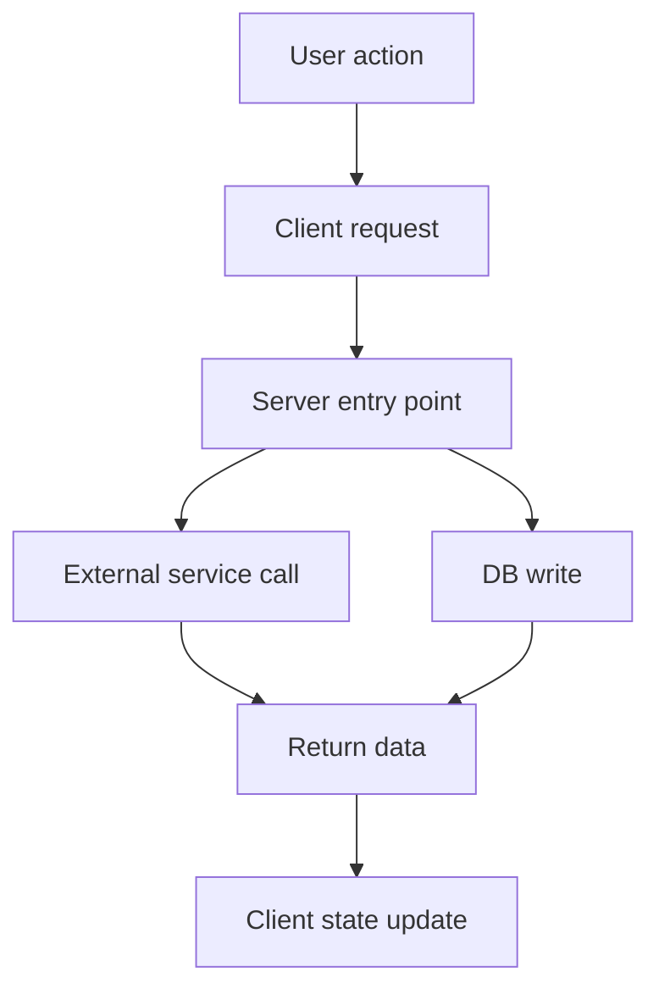
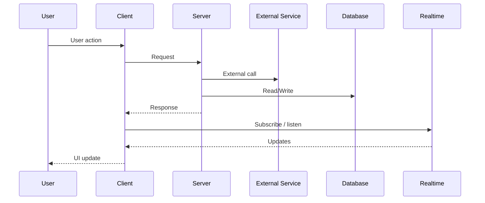

# Architecture Diagrams

- Keep the diagram high-level.
- Save the result under `docs/architecture/{feature}-flow.md` unless the user asks for a different path.

## What to include

- Main requests and entry points
- External services
- Database effects
- Client update path

## What to avoid

- Low-level implementation details
- Every helper function
- Internal utility calls

## Output Format

### Summary

One short paragraph describing what the flow does end-to-end.

### High-Level Flow

### Sequence View

### DB Effects

- `table_name`: what is inserted / updated / deleted
- `table_name`: what is read for context

### Notes

- Put only the important invariants here
- Mention any intentional async / realtime path
